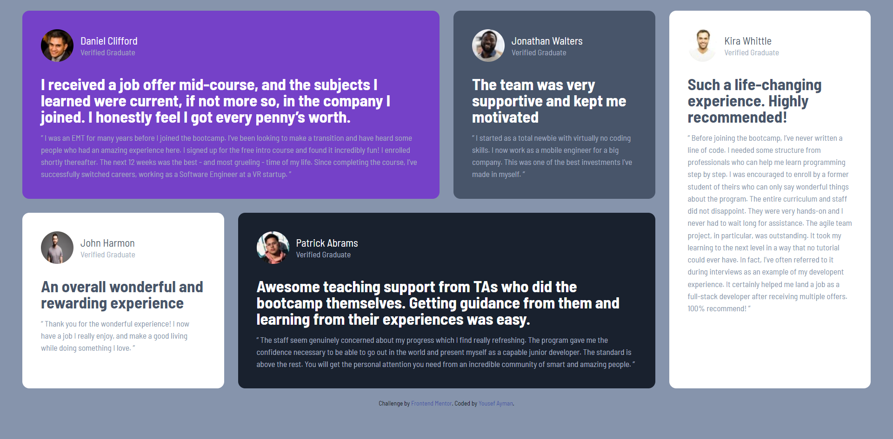

# Frontend Mentor - Testimonials grid section solution

This is a solution to the [Testimonials grid section challenge on Frontend Mentor](https://www.frontendmentor.io/challenges/testimonials-grid-section-Nnw6J7Un7). Frontend Mentor challenges help you improve your coding skills by building realistic projects.

## Overview

### The challenge

Users should be able to:

- View the optimal layout for the site depending on their device's screen size

### Screenshot

### Links

- Solution URL: [Add solution URL here](https://your-solution-url.com)
- Live Site URL: [Testimonials Grid section](https://yussif20.github.io/testimonials-grid-section/)

## My process

### Built with

- Semantic HTML5 markup
- CSS custom properties
- CSS Grid

## Author

- Website - [Yusif Ayman](https://yussif20.github.io/main-portfolio/)
- linkedin - [Yusif Ayman](https://www.linkedin.com/in/yussif-ayman/)
- Github - [Yusif Ayman](https://github.com/Yussif20)
- Frontend Mentor - [testimonials-grid-solution](https://www.frontendmentor.io/solutions/testimonials-grid-section-8YR1y_8E9R)
